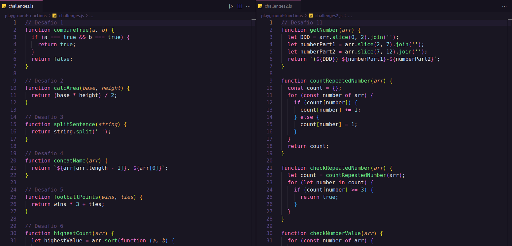

# :pushpin: Playground Functions

Você pode ver o código dos _Requisitos Obrigatórios_ [clicando aqui](https://github.com/GabrielFQK/playground-functions/blob/main/challenges.js) e dos _Requisitos Bônus_ [aqui](https://github.com/GabrielFQK/playground-functions/blob/main/challenges2.js)

## :pencil: Sobre

Projeto desenvolvido com _JavaScript_ por [mim](https://linkedin.com/in/gabrielfqk) para o fim do bloco 04 do módulo de [Fundamentos](https://github.com/GabrielFQK/trybe-exercicios/tree/main/1-fundamentos) do Curso de Desenvolvimento Web da [Trybe](https://betrybe.com).

O projeto consistia em implementar o código de `funções` que resolvem problemas com respostas pré-determinadas usando os conhecimentos em JavaScript que desenvolvi ao longo do _módulo 04_. Eu pude utilizar a lógica de programação para me ajudar na análise de cada problema e resposta esperada, facilitando a implementação do código de cada uma das funções.

## :hammer: Habilidades

**Com esse projeto fui capaz de:**

- Utilizar _JavaScript_ na prática para resolução de problemas;
- Desenvolver minha _lógica de programação_;
- Quebrar grandes problemas em problemas menores;
- Aprender como `refatorar` e `indentar` códigos.
